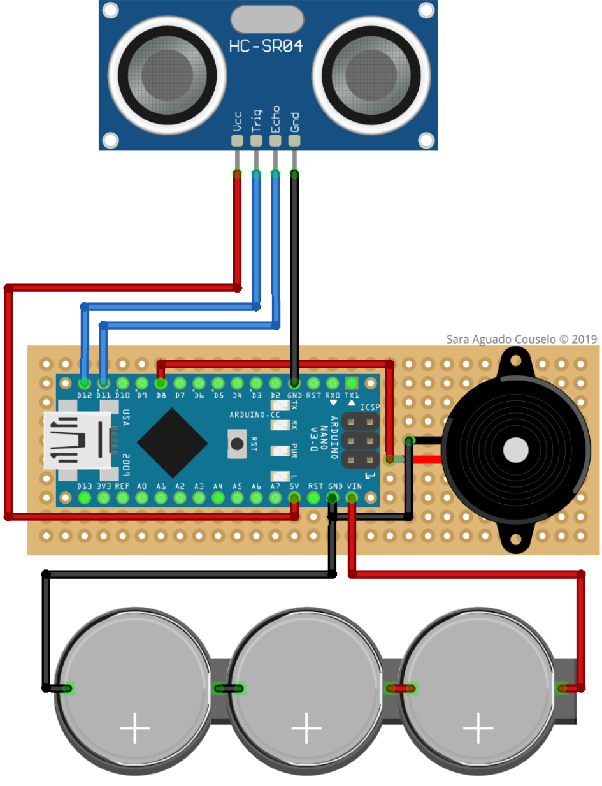
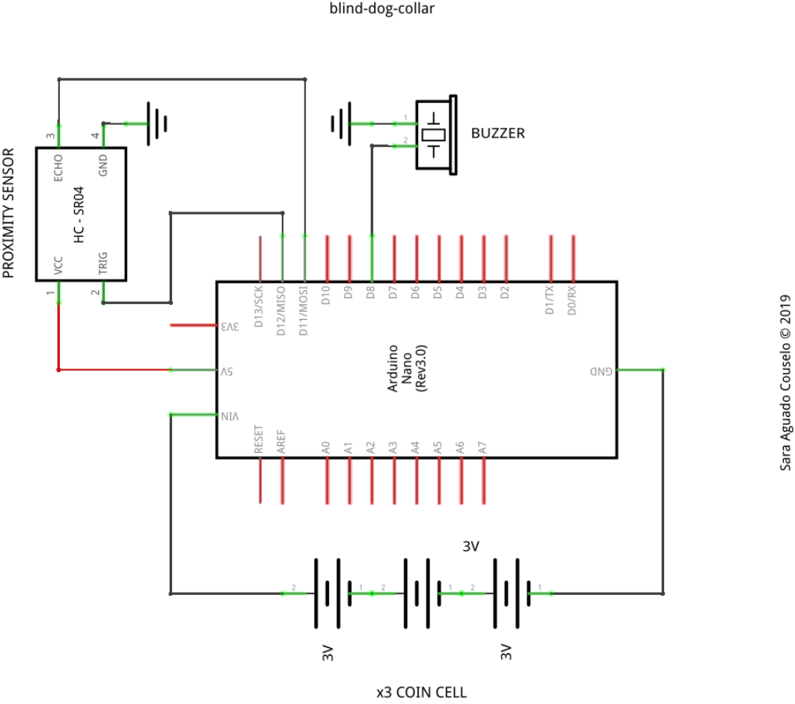

# cancego

*Cancego* é un proxecto de colar para cans cegos ou con visibilidade moi reducida. Consiste nun aviso sonoro que indica da proximidade dun obstáculo. A [libraría](./lib/HC-SR04/) empregada para a lectura do sensor de proximidade foi obtida da páxina web de [ELEGOO](https://www.elegoo.com/download/). 

Calquera pode empregar, modificar e distribuir este proxecto baixo os termos da [licencia GLPv3](./LICENSE).

## Montaxe e esquema eléctrico:

> Sara Aguado Couselo (2019)
